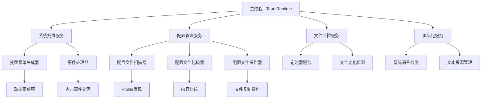

# CCCS 设计文档

## 概述

CCCS（Claude Code Configuration Switcher）是一个基于Tauri 2.0的跨平台桌面应用程序，专门用于管理和切换Claude Code的配置文件。应用程序通过系统托盘界面提供简洁的配置管理功能，支持多语言界面和实时配置监控。

### 核心功能
- 自动检测Claude Code安装
- 配置文件扫描和验证
- 系统托盘集成
- 实时配置状态监控
- 配置文件快速切换
- 多语言支持

## 架构

### 技术栈
- **后端**: Rust (Tauri 2.0)
- **前端**: TypeScript + Vite
- **UI框架**: 原生HTML/CSS/JS
- **文件系统**: Tauri FS Plugin
- **系统托盘**: Tauri Tray API
- **国际化**: 基于系统locale的静态文本

### 架构模式



## 组件和接口

### 1. 主应用程序 (App)

**职责**: 应用程序入口点和生命周期管理

**接口**:
```rust
struct App {
    config_service: ConfigService,
    tray_service: TrayService,
    monitor_service: MonitorService,
    i18n_service: I18nService,
    settings_service: SettingsService,
}

impl App {
    fn new() -> Result<Self, AppError>;
    fn initialize(&mut self) -> Result<(), AppError>;
    fn run(&self) -> Result<(), AppError>;
    fn shutdown(&self) -> Result<(), AppError>;
    fn update_monitor_interval(&mut self, minutes: u64) -> Result<(), AppError>;
}
```

### 2. 配置服务 (ConfigService)

**职责**: 处理Claude Code配置文件的发现、验证、比较和操作

**接口**:
```rust
struct ConfigService {
    claude_dir: PathBuf,
    profiles: Vec<Profile>,
}

#[derive(Debug, Clone)]
struct Profile {
    name: String,
    path: PathBuf,
    content: String,
    is_active: bool,
}

impl ConfigService {
    fn detect_claude_installation() -> Result<PathBuf, ConfigError>;
    fn scan_profiles(&mut self) -> Result<Vec<Profile>, ConfigError>;
    fn validate_default_config() -> Result<(), ConfigError>;
    fn compare_profiles(&self) -> Vec<ProfileStatus>;
    fn switch_profile(&mut self, profile_name: &str) -> Result<(), ConfigError>;
    fn get_profile_status(&self, profile_name: &str) -> ProfileStatus;
}

enum ProfileStatus {
    Active,
    Inactive,
    Error(String),
}
```

### 3. 系统托盘服务 (TrayService)

**职责**: 管理系统托盘图标、菜单生成和事件处理

**接口**:
```rust
struct TrayService {
    tray_icon: Option<TrayIcon>,
    menu_builder: MenuBuilder,
    event_handler: TrayEventHandler,
}

impl TrayService {
    fn create_tray(&mut self, app: &AppHandle) -> Result<(), TrayError>;
    fn update_menu(&mut self, profiles: &[Profile]) -> Result<(), TrayError>;
    fn handle_menu_click(&self, event_id: &str) -> Result<(), TrayError>;
    fn show_settings_window(&self) -> Result<(), TrayError>;
}
```

### 4. 监控服务 (MonitorService)

**职责**: 定时监控特定配置文件变化，更新托盘菜单状态

**监控策略**: 只监控关键配置文件，避免扫描整个.claude目录
- `settings.json` (默认配置文件)
- `*.settings.json` (各个profile配置文件)

**接口**:
```rust
struct MonitorService {
    timer: Option<tokio::time::Interval>,
    monitored_files: Vec<PathBuf>,
    file_metadata: HashMap<PathBuf, FileMetadata>,
    monitor_interval_minutes: u64,
}

#[derive(Debug, Clone)]
struct FileMetadata {
    modified_time: SystemTime,
    checksum: u32,  // 使用CRC32快速校验
    size: u64,
}

impl MonitorService {
    fn new(interval_minutes: u64) -> Self;
    fn set_monitor_interval(&mut self, minutes: u64) -> Result<(), MonitorError>;
    fn add_file_to_monitor(&mut self, path: PathBuf);
    fn start_monitoring(&mut self, callback: Arc<dyn Fn() + Send + Sync>) -> Result<(), MonitorError>;
    fn stop_monitoring(&mut self);
    fn force_scan(&self) -> Result<Vec<ConfigFileChange>, MonitorError>;
    fn efficient_file_check(&self, path: &Path) -> Result<bool, MonitorError>;
}

#[derive(Debug)]
struct ConfigFileChange {
    file_path: PathBuf,
    change_type: ChangeType,
}

enum ChangeType {
    Modified,
    Created,
    Deleted,
}
```

### 5. 国际化服务 (I18nService)

**职责**: 管理多语言文本资源和系统语言检测

**接口**:
```rust
struct I18nService {
    current_locale: String,
    text_resources: HashMap<String, HashMap<String, String>>,
}

impl I18nService {
    fn detect_system_locale() -> String;
    fn load_text_resources(&mut self) -> Result<(), I18nError>;
    fn get_text(&self, key: &str) -> String;
    fn get_supported_locales() -> Vec<String>;
}
```

### 6. 设置服务 (SettingsService)

**职责**: 管理用户配置的持久化存储和设置界面

**接口**:
```rust
struct SettingsService {
    settings_file_path: PathBuf,
    current_settings: UserSettings,
}

impl SettingsService {
    fn new() -> Result<Self, SettingsError>;
    fn load_settings(&mut self) -> Result<UserSettings, SettingsError>;
    fn save_settings(&self, settings: &UserSettings) -> Result<(), SettingsError>;
    fn validate_monitor_interval(minutes: u64) -> Result<(), SettingsError>;
    fn open_settings_window(&self, app: &AppHandle) -> Result<(), SettingsError>;
}
```

## 数据模型

### 配置文件模型

```rust
#[derive(Debug, Clone, Serialize, Deserialize)]
struct ClaudeConfig {
    // Claude Code配置的典型结构
    settings: serde_json::Value,
}

#[derive(Debug, Clone)]
struct ProfileMetadata {
    name: String,
    path: PathBuf,
    last_modified: SystemTime,
    size: u64,
    checksum: String,
}
```

### 用户设置模型

```rust
#[derive(Debug, Clone, Serialize, Deserialize)]
struct UserSettings {
    monitor_interval_minutes: u64,  // 1-60分钟
    auto_start_monitoring: bool,
    language: Option<String>,        // None表示跟随系统
    show_notifications: bool,
}

impl Default for UserSettings {
    fn default() -> Self {
        Self {
            monitor_interval_minutes: 5,  // 默认5分钟
            auto_start_monitoring: true,
            language: None,
            show_notifications: true,
        }
    }
}
```

### 应用程序状态

```rust
#[derive(Debug)]
struct AppState {
    is_initialized: bool,
    claude_dir: Option<PathBuf>,
    profiles: Vec<Profile>,
    current_locale: String,
    monitoring_enabled: bool,
    user_settings: UserSettings,
}
```

### 错误模型

```rust
#[derive(Debug, thiserror::Error)]
enum AppError {
    #[error("Claude Code installation not found")]
    ClaudeNotFound,
    #[error("Configuration file error: {0}")]
    ConfigError(String),
    #[error("Tray operation failed: {0}")]
    TrayError(String),
    #[error("File system error: {0}")]
    FileSystemError(String),
    #[error("Permission denied: {0}")]
    PermissionError(String),
}
```

## 错误处理

### 错误处理策略

1. **启动时错误**: 
   - Claude Code未安装 → 显示文件选择对话框
   - 配置文件不存在 → 显示错误消息并退出
   - 权限不足 → 显示权限请求提示

2. **运行时错误**:
   - 配置文件读取失败 → 在托盘菜单显示错误状态
   - 文件写入失败 → 显示错误通知
   - 监控服务异常 → 自动重启监控

3. **用户交互错误**:
   - 无效的配置文件选择 → 显示警告消息
   - 网络连接问题 → 优雅降级到本地功能

### 错误恢复机制

```rust
impl ErrorRecovery {
    fn handle_config_error(&self, error: ConfigError) -> RecoveryAction {
        match error {
            ConfigError::FileNotFound => RecoveryAction::PromptUser,
            ConfigError::PermissionDenied => RecoveryAction::ShowPermissionDialog,
            ConfigError::InvalidFormat => RecoveryAction::ShowErrorAndContinue,
            _ => RecoveryAction::LogAndContinue,
        }
    }
    
    fn auto_retry_monitoring(&self, max_retries: u32) -> bool {
        // 自动重试监控服务
    }
}
```

## 用户界面设计

### 设置页面设计

设置页面是一个独立的窗口，包含应用程序的配置选项和信息。

#### 页面布局

```
┌─────────────────────────────────────────┐
│  CCCS - 设置                             │
├─────────────────────────────────────────┤
│                                         │
│  应用程序信息                           │
│  ─────────────────────                  │
│  CCCS (Claude Code Configuration        │
│  Switcher) 是一个用于快速切换            │
│  Claude Code 配置文件的工具。           │
│                                         │
│  监控设置                               │
│  ─────────────────────                  │
│  配置文件监控间隔:                      │
│  [  5  ] 分钟  ▲▼                      │
│  (有效范围: 1-60 分钟)                  │
│                                         │
│  □ 启动时自动开始监控                   │
│  □ 显示配置切换通知                     │
│                                         │
│  语言设置                               │
│  ─────────────────────                  │
│  界面语言: [跟随系统  ▼]                │
│           中文                          │
│           English                       │
│                                         │
│  当前状态                               │
│  ─────────────────────                  │
│  Claude Code 目录: ~/.claude            │
│  发现的配置文件: 3 个                   │
│  监控状态: 运行中                       │
│                                         │
│               [关闭]                    │
└─────────────────────────────────────────┘
```

#### 界面元素详细说明

1. **监控间隔设置**:
   - 数字输入框，支持1-60分钟
   - 上下箭头按钮用于快速调整
   - 实时验证输入有效性
   - 更改后立即生效

2. **开关选项**:
   - 复选框控制自动监控和通知
   - 状态保存到用户配置文件

3. **语言选择**:
   - 下拉菜单支持系统自动、中文、英文
   - 切换后立即应用到界面

4. **状态信息**:
   - 只读显示当前系统状态
   - 实时更新监控状态

#### 设置页面交互逻辑

```rust
#[derive(Debug)]
struct SettingsWindow {
    app_handle: AppHandle,
    current_settings: UserSettings,
    window_handle: Option<WebviewWindow>,
}

impl SettingsWindow {
    fn open(&mut self) -> Result<(), SettingsError> {
        if self.window_handle.is_some() {
            // 如果窗口已存在，则聚焦到前台
            self.focus_existing_window()
        } else {
            // 创建新的设置窗口
            self.create_settings_window()
        }
    }
    
    fn create_settings_window(&mut self) -> Result<(), SettingsError> {
        let window = WebviewWindowBuilder::new(
            &self.app_handle,
            "settings",
            WebviewUrl::App("settings.html".into())
        )
        .title("CCCS - 设置")
        .inner_size(450.0, 600.0)
        .resizable(false)
        .center()
        .build()?;
        
        self.window_handle = Some(window);
        Ok(())
    }
    
    fn handle_monitor_interval_change(&mut self, minutes: u64) -> Result<(), SettingsError> {
        // 验证输入范围
        if !(1..=60).contains(&minutes) {
            return Err(SettingsError::InvalidInterval(minutes));
        }
        
        // 更新设置
        self.current_settings.monitor_interval_minutes = minutes;
        
        // 保存到文件
        self.save_settings()?;
        
        // 通知主应用更新监控间隔
        self.app_handle.emit("settings_changed", &self.current_settings)?;
        
        Ok(())
    }
}
```

## 测试策略

### 单元测试

1. **配置服务测试**:
   - 配置文件扫描功能
   - 配置文件比较逻辑
   - 配置切换操作

2. **文件操作测试**:
   - 文件读取/写入操作
   - 权限处理
   - 错误场景模拟

3. **国际化测试**:
   - 语言检测功能
   - 文本资源加载
   - 缺失翻译处理

### 集成测试

1. **系统托盘集成**:
   - 托盘图标创建
   - 菜单更新机制
   - 事件处理流程

2. **端到端测试**:
   - 完整的配置切换流程
   - 错误处理场景
   - 多语言界面切换

### 性能测试

1. **文件监控性能**:
   - 大量配置文件扫描
   - 监控频率优化
   - 内存使用情况

2. **启动性能**:
   - 应用启动时间
   - 托盘图标显示延迟

## 技术决策和理由

### 1. 使用Tauri 2.0
- **优势**: 跨平台、小体积、安全性、原生性能
- **权衡**: 需要Rust知识，生态系统相对较小

### 2. 精确文件监控 vs 目录监控
- **选择**: 精确文件监控（只监控特定配置文件）
- **理由**: 
  - 避免监控整个`.claude`目录带来的性能问题
  - Claude Code运行时会频繁写入日志、缓存等文件
  - 只关注真正重要的配置文件：`settings.json`和`*.settings.json`
  - 减少无关文件变化事件的干扰

### 3. 定时监控 vs 文件系统事件
- **选择**: 定时监控（用户可配置间隔）
- **理由**: 
  - 简单可靠，避免文件系统事件的复杂性和平台差异
  - 降低系统资源消耗
  - 更好的跨平台兼容性
  - 用户可根据需要调整监控频率（1-60分钟）

### 4. 性能优化策略
- **选择**: 分层检查（修改时间 + 内容校验）
- **理由**:
  - 先检查文件修改时间，快速过滤未变化的文件
  - 只有修改时间变化时才读取文件内容
  - 使用CRC32快速校验和算法而非SHA
  - 最小化磁盘I/O操作

### 5. 静态国际化 vs 动态加载
- **选择**: 静态编译时国际化
- **理由**:
  - 减少运行时开销
  - 简化部署
  - 足够满足当前需求（中英文）

### 6. 内存缓存 vs 实时读取
- **选择**: 混合方案
- **理由**:
  - 配置文件内容缓存以提高比较性能
  - 文件元数据实时读取以确保准确性

### 7. 单一托盘图标 vs 状态指示
- **选择**: 单一图标 + 菜单项状态
- **理由**:
  - 保持界面简洁
  - 符合系统托盘最佳实践
  - 避免过多的视觉干扰

## 安全考虑

### 文件系统权限
- 限制只访问Claude Code配置目录
- 验证文件路径防止目录遍历攻击
- 使用Tauri的权限系统限制文件操作范围

### 配置文件验证
- 验证JSON格式的有效性
- 检查文件大小限制
- 防止恶意配置文件注入

### 进程安全
- 最小权限原则运行
- 安全的错误消息处理
- 防止敏感信息泄露

这个设计文档为CCCS应用程序提供了完整的技术蓝图，涵盖了从架构设计到实现细节的各个方面，确保应用程序能够安全、高效地满足所有需求。