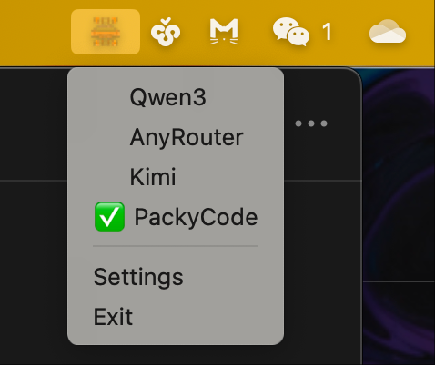
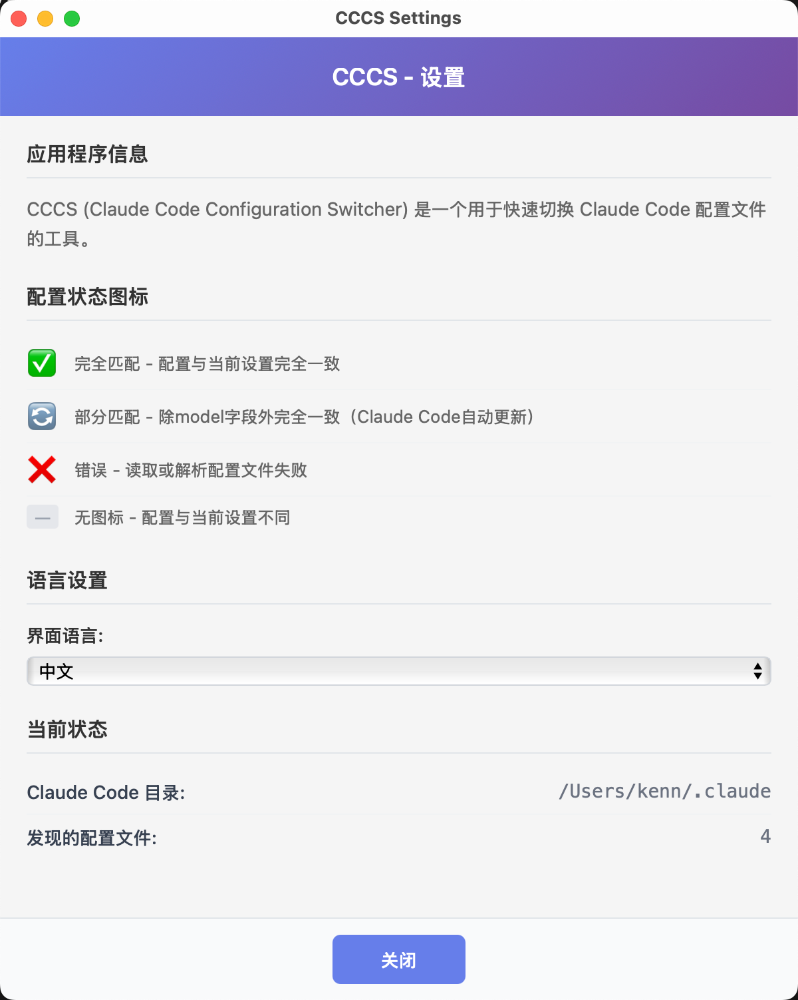

# CCCS - Claude Code Configuration Switcher

[中文文档](./README.CN.md) | English

A lightweight desktop application for quickly switching Claude Code configuration files.

## Features

- **Quick Profile Switching**: Switch between different Claude Code configurations with a single click from the system tray
- **Smart Status Indicators**: Visual indicators showing profile status:
  - ✅ **Full Match** - Configuration fully matches current settings
  - 🔄 **Partial Match** - Identical except model field (auto-updated by Claude Code)
  - ❌ **Error** - Failed to read or parse configuration file
  - **No Icon** - Configuration differs from current settings
- **Automatic Detection**: Automatically detects Claude Code installation and configuration files
- **Real-time Monitoring**: Monitors configuration changes and updates status accordingly
- **Multi-language Support**: Supports English and Chinese interfaces
- **System Tray Integration**: Runs in the background with minimal resource usage

## Installation

### Prerequisites

- Claude Code must be installed on your system
- macOS, Windows, or Linux

### Download

Currently, please download the source code and build it yourself. Pre-built binaries will be available in future releases.

```bash
# Clone the repository
git clone https://github.com/breakstring/cccs.git
cd cccs

# Install dependencies
npm install

# Build for production
npm run tauri build
```

## Usage

### System Tray Menu



*CCCS system tray menu showing different profile statuses*

### Profile File Format

CCCS automatically scans for configuration files in your Claude Code directory (`~/.claude/` on macOS/Linux, `%USERPROFILE%\.claude\` on Windows).

**Profile File Naming Convention:**
- Profile files must follow the pattern: `{ProfileName}.settings.json`
- Examples:
  - `Work.settings.json`
  - `Personal.settings.json`
  - `Development.settings.json`

**File Location:**
- macOS/Linux: `~/.claude/`
- Windows: `%USERPROFILE%\.claude\`

**Important Notes:**
- The main `settings.json` file is your current active configuration
- Profile files should contain valid JSON configuration data
- CCCS intelligently ignores the `model` field when comparing configurations, as Claude Code updates this automatically

### Getting Started

1. **Launch CCCS**: The application will appear in your system tray
2. **Create Profiles**: Copy your current `~/.claude/settings.json` to create profile files (e.g., `Work.settings.json`)
3. **Switch Profiles**: Right-click the tray icon and select your desired profile
4. **Monitor Status**: Hover over the tray icon to refresh profile status

### Configuration



*CCCS settings page with profile status explanations*

Access settings by right-clicking the tray icon and selecting "Settings":

- **Language**: Choose between English and Chinese
- **Status Icons Guide**: Reference for understanding profile status indicators

## About This Project

This project serves as a demonstration of **Vibe Coding** using Claude Code. We've included the original prompts and development artifacts produced using Kiro's SPECS methodology for reference:

- **Original Prompts**: Located in `./doc/` - Contains the initial project requirements and development prompts
- **SPECS Development Process**: Located in `./kiro/claude-config-switcher/` - Shows the complete development workflow using Kiro's structured approach

If you're interested in learning about AI-assisted development workflows or want to see how this project was built from scratch using Claude Code, feel free to explore these resources.

## Development

### Prerequisites

- Node.js (v16 or later)
- Rust (latest stable)
- Tauri CLI

**Note**: This project has only been tested on macOS as the developer currently has access to only a Mac laptop. While Tauri framework theoretically supports Linux and Windows, users on these platforms are welcome to explore and test the compatibility themselves.

### Building from Source

```bash
# Clone the repository
git clone https://github.com/breakstring/cccs.git
cd cccs

# Install dependencies
npm install

# Run in development mode
npm run tauri dev

# Build for production
npm run tauri build
```

### Project Structure

```
cccs/
├── src/                # Frontend (TypeScript/Vite)
├── src-tauri/          # Backend (Rust/Tauri)
├── public/             # Static assets
└── dist/               # Built frontend assets
```

## Contributing

1. Fork the repository
2. Create a feature branch
3. Commit your changes
4. Push to the branch
5. Create a Pull Request

## License

This project is licensed under the MIT License - see the [LICENSE](LICENSE) file for details.

## Roadmap

- [ ] Profile Configuration Editor
- [x] Custom Icon Support

## Support

If you encounter any issues or have questions:

1. Check the [Issues](https://github.com/breakstring/cccs/issues) page
2. Create a new issue if your problem isn't already reported
3. Provide detailed information about your system and the issue

---

Made with ❤️ by [KZAI Lab](https://github.com/breakstring)